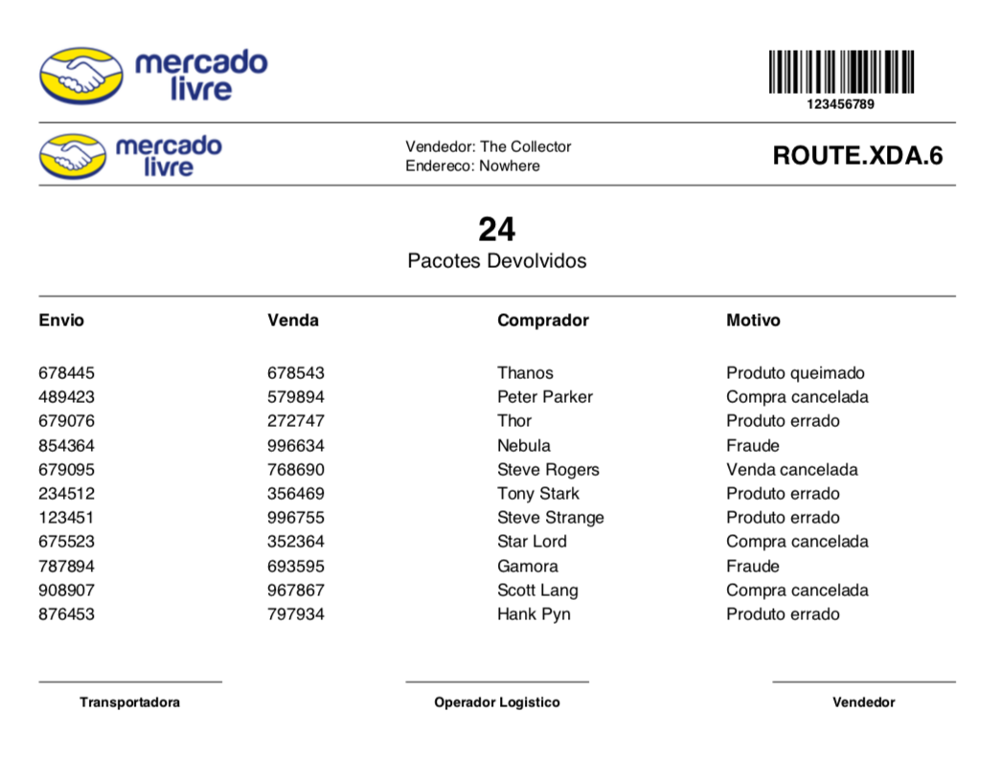

# Maroto
A Maroto way to create PDFs. Maroto is inspired in Bootstrap and uses [Gofpdf](https://github.com/jung-kurt/gofpdf). Fast and simple.

> Maroto definition: Brazilian expression, means an astute/clever/intelligent person.

## Example

#### Result


#### Code
```go
func main() {
	m := maroto.NewMaroto(enums.Vertical, enums.A4)
	header, contents := getContents()

	m.Row("MeliBarcode", 20, func() {
		m.Col("Logo", func() {
			m.Image("assets/images/mercado_livre.png", 4)
		})

		m.ColSpaces(2)

		m.Col("Barcode", func() {
			id := "123456789"
			m.Barcode(id, 30, 9, 5)
			m.Text(id, font.Arial, font.Bold, 8, 17, enums.CenterH)
		})
	})

	m.Line()

	m.Row("Destiny", 12, func() {
		m.Col("Logo", func() {
			m.Image("assets/images/mercado_livre.png", 1)
		})

		m.ColSpace()

		m.Col("Packages", func() {
			m.Text("Vendedor: The Collector", font.Arial, font.Normal, 9, 5, enums.Left)
			m.Text("Endereco: Nowhere", font.Arial, font.Normal, 9, 9, enums.Left)
		})

		m.ColSpace()

		m.Col("Route", func() {
			m.Text("ROUTE.XDA.6", font.Arial, font.Bold, 15, 7.5, enums.Left)
		})
	})

	m.Line()

	m.Row("Packages Title", 22, func() {
		m.ColSpaces(2)

		m.Col("Packages", func() {
			m.Text("24", font.Arial, font.Bold, 20, 10.5, enums.CenterH)
			m.Text("Pacotes Devolvidos", font.Arial, font.Normal, 12, 16, enums.CenterH)
		})

		m.ColSpaces(2)
	})

	m.Line()

	m.RowTableList("Packages", header, contents)

	m.Row("Signature", 15, func() {
		m.Col("Carrier", func() {
			m.Sign("Transportadora", font.Arial, font.Bold, 8)
		})

		m.ColSpace()

		m.Col("LogisticOperator", func() {
			m.Sign("Operador Logistico", font.Arial, font.Bold, 8)
		})

		m.ColSpace()

		m.Col("Seller", func() {
			m.Sign("Vendedor", font.Arial, font.Bold, 8)
		})
	})

	m.OutputFileAndClose("maroto.pdf")
}
```