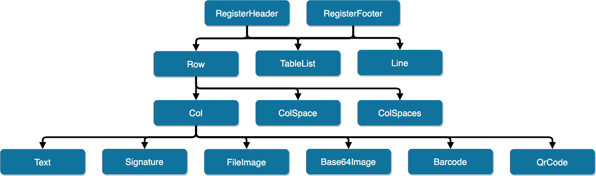

# Maroto 

[](https://godoc.org/github.com/johnfercher/maroto)
[][travis] 
[](https://codecov.io/gh/johnfercher/maroto) 
[](https://goreportcard.com/report/github.com/johnfercher/maroto)
[](https://github.com/avelino/awesome-go#template-engines)  

A Maroto way to create PDFs. Maroto is inspired in Bootstrap and uses [Gofpdf](https://github.com/jung-kurt/gofpdf). Fast and simple.

> Maroto definition: Brazilian expression, means an astute/clever/intelligent person.

You can write your PDFs like you are creating a site using Bootstrap. A Row may have many Cols, and a Col may have many components. 
Besides that, pages will be added when content may extrapolate the useful area. You can define a header which will be added
always when a new page appear, in this case, a header may have many rows, lines or tablelist. 

## Installation

* With `go get`:

```bash
go get -u github.com/johnfercher/maroto/internal
```

## Contributing

| Command         | Description                                       | Dependencies                           |
|-----------------|---------------------------------------------------|----------------------------------------|
| `make fmt`      | Format files                                      | `gofmt`, `gofumpt` and `goimports`     |
| `make lint`     | Check files                                       | `golangci-lint` and `goreportcard-cli` |
| `make dod`      | (Definition of Done) Format files and check files | Same as `make fmt` and `make lint`     | 
| `make install`  | Install all dependencies                          | `go`, `curl` and `git`                 |
| `make examples` | Run all examples                                  | `go`                |

## Features

<!--%3CmxGraphModel%3E%3Croot%3E%3CmxCell%20id%3D%220%22%2F%3E%3CmxCell%20id%3D%221%22%20parent%3D%220%22%2F%3E%3CmxCell%20id%3D%222%22%20style%3D%22edgeStyle%3DorthogonalEdgeStyle%3BorthogonalLoop%3D1%3BjettySize%3Dauto%3Bhtml%3D1%3BexitX%3D0.5%3BexitY%3D1%3BexitDx%3D0%3BexitDy%3D0%3BentryX%3D0.5%3BentryY%3D0%3BentryDx%3D0%3BentryDy%3D0%3BfontSize%3D21%3Brounded%3D1%3BfillColor%3D%23647687%3BstrokeColor%3D%23314354%3BstrokeWidth%3D4%3BendArrow%3Dblock%3BendFill%3D1%3BfontStyle%3D0%22%20edge%3D%221%22%20source%3D%225%22%20target%3D%2213%22%20parent%3D%221%22%3E%3CmxGeometry%20relative%3D%221%22%20as%3D%22geometry%22%2F%3E%3C%2FmxCell%3E%3CmxCell%20id%3D%223%22%20style%3D%22edgeStyle%3DorthogonalEdgeStyle%3Brounded%3D1%3BorthogonalLoop%3D1%3BjettySize%3Dauto%3Bhtml%3D1%3BexitX%3D0.5%3BexitY%3D1%3BexitDx%3D0%3BexitDy%3D0%3BentryX%3D0.5%3BentryY%3D0%3BentryDx%3D0%3BentryDy%3D0%3BendArrow%3Dblock%3BendFill%3D1%3BstrokeWidth%3D4%3BfontSize%3D21%3BfontStyle%3D0%22%20edge%3D%221%22%20source%3D%225%22%20target%3D%2214%22%20parent%3D%221%22%3E%3CmxGeometry%20relative%3D%221%22%20as%3D%22geometry%22%2F%3E%3C%2FmxCell%3E%3CmxCell%20id%3D%224%22%20style%3D%22edgeStyle%3DorthogonalEdgeStyle%3Brounded%3D1%3BorthogonalLoop%3D1%3BjettySize%3Dauto%3Bhtml%3D1%3BexitX%3D0.5%3BexitY%3D1%3BexitDx%3D0%3BexitDy%3D0%3BentryX%3D0.5%3BentryY%3D0%3BentryDx%3D0%3BentryDy%3D0%3BendArrow%3Dblock%3BendFill%3D1%3BstrokeWidth%3D4%3BfontSize%3D21%3BfontStyle%3D0%22%20edge%3D%221%22%20source%3D%225%22%20target%3D%2215%22%20parent%3D%221%22%3E%3CmxGeometry%20relative%3D%221%22%20as%3D%22geometry%22%2F%3E%3C%2FmxCell%3E%3CmxCell%20id%3D%225%22%20value%3D%22RegisterHeader%22%20style%3D%22rounded%3D1%3BfillColor%3D%2310739E%3BstrokeColor%3Dnone%3Bshadow%3D1%3BgradientColor%3Dnone%3BfontStyle%3D0%3BfontColor%3D%23FFFFFF%3BfontSize%3D21%3B%22%20vertex%3D%221%22%20parent%3D%221%22%3E%3CmxGeometry%20x%3D%221261%22%20y%3D%22380%22%20width%3D%22200%22%20height%3D%2260%22%20as%3D%22geometry%22%2F%3E%3C%2FmxCell%3E%3CmxCell%20id%3D%226%22%20style%3D%22edgeStyle%3DorthogonalEdgeStyle%3Brounded%3D1%3BorthogonalLoop%3D1%3BjettySize%3Dauto%3Bhtml%3D1%3BexitX%3D0.5%3BexitY%3D1%3BexitDx%3D0%3BexitDy%3D0%3BentryX%3D0.5%3BentryY%3D0%3BentryDx%3D0%3BentryDy%3D0%3BendArrow%3Dblock%3BendFill%3D1%3BstrokeWidth%3D4%3BfontSize%3D21%3BfontStyle%3D0%22%20edge%3D%221%22%20source%3D%229%22%20target%3D%2213%22%20parent%3D%221%22%3E%3CmxGeometry%20relative%3D%221%22%20as%3D%22geometry%22%2F%3E%3C%2FmxCell%3E%3CmxCell%20id%3D%227%22%20style%3D%22edgeStyle%3DorthogonalEdgeStyle%3Brounded%3D1%3BorthogonalLoop%3D1%3BjettySize%3Dauto%3Bhtml%3D1%3BexitX%3D0.5%3BexitY%3D1%3BexitDx%3D0%3BexitDy%3D0%3BentryX%3D0.5%3BentryY%3D0%3BentryDx%3D0%3BentryDy%3D0%3BendArrow%3Dblock%3BendFill%3D1%3BstrokeWidth%3D4%3BfontSize%3D21%3BfontStyle%3D0%22%20edge%3D%221%22%20source%3D%229%22%20target%3D%2215%22%20parent%3D%221%22%3E%3CmxGeometry%20relative%3D%221%22%20as%3D%22geometry%22%2F%3E%3C%2FmxCell%3E%3CmxCell%20id%3D%228%22%20style%3D%22edgeStyle%3DorthogonalEdgeStyle%3Brounded%3D1%3BorthogonalLoop%3D1%3BjettySize%3Dauto%3Bhtml%3D1%3BexitX%3D0.5%3BexitY%3D1%3BexitDx%3D0%3BexitDy%3D0%3BentryX%3D0.5%3BentryY%3D0%3BentryDx%3D0%3BentryDy%3D0%3BendArrow%3Dblock%3BendFill%3D1%3BstrokeWidth%3D4%3BfontSize%3D21%3Bshadow%3D0%3BfontStyle%3D0%22%20edge%3D%221%22%20source%3D%229%22%20target%3D%2214%22%20parent%3D%221%22%3E%3CmxGeometry%20relative%3D%221%22%20as%3D%22geometry%22%2F%3E%3C%2FmxCell%3E%3CmxCell%20id%3D%229%22%20value%3D%22RegisterFooter%22%20style%3D%22rounded%3D1%3BfillColor%3D%2310739E%3BstrokeColor%3Dnone%3Bshadow%3D1%3BgradientColor%3Dnone%3BfontStyle%3D0%3BfontColor%3D%23FFFFFF%3BfontSize%3D21%3B%22%20vertex%3D%221%22%20parent%3D%221%22%3E%3CmxGeometry%20x%3D%221501%22%20y%3D%22380%22%20width%3D%22220%22%20height%3D%2260%22%20as%3D%22geometry%22%2F%3E%3C%2FmxCell%3E%3CmxCell%20id%3D%2210%22%20style%3D%22edgeStyle%3DorthogonalEdgeStyle%3Brounded%3D1%3BorthogonalLoop%3D1%3BjettySize%3Dauto%3Bhtml%3D1%3BexitX%3D0.5%3BexitY%3D1%3BexitDx%3D0%3BexitDy%3D0%3BentryX%3D0.5%3BentryY%3D0%3BentryDx%3D0%3BentryDy%3D0%3Bshadow%3D0%3BendArrow%3Dblock%3BendFill%3D1%3BstrokeWidth%3D4%3BfontSize%3D21%3BfontStyle%3D0%22%20edge%3D%221%22%20source%3D%2213%22%20target%3D%2222%22%20parent%3D%221%22%3E%3CmxGeometry%20relative%3D%221%22%20as%3D%22geometry%22%2F%3E%3C%2FmxCell%3E%3CmxCell%20id%3D%2211%22%20style%3D%22edgeStyle%3DorthogonalEdgeStyle%3Brounded%3D1%3BorthogonalLoop%3D1%3BjettySize%3Dauto%3Bhtml%3D1%3BexitX%3D0.5%3BexitY%3D1%3BexitDx%3D0%3BexitDy%3D0%3BentryX%3D0.5%3BentryY%3D0%3BentryDx%3D0%3BentryDy%3D0%3Bshadow%3D0%3BendArrow%3Dblock%3BendFill%3D1%3BstrokeWidth%3D4%3BfontSize%3D21%3BfontStyle%3D0%22%20edge%3D%221%22%20source%3D%2213%22%20target%3D%2223%22%20parent%3D%221%22%3E%3CmxGeometry%20relative%3D%221%22%20as%3D%22geometry%22%2F%3E%3C%2FmxCell%3E%3CmxCell%20id%3D%2212%22%20style%3D%22edgeStyle%3DorthogonalEdgeStyle%3Brounded%3D1%3BorthogonalLoop%3D1%3BjettySize%3Dauto%3Bhtml%3D1%3BexitX%3D0.5%3BexitY%3D1%3BexitDx%3D0%3BexitDy%3D0%3BentryX%3D0.5%3BentryY%3D0%3BentryDx%3D0%3BentryDy%3D0%3Bshadow%3D0%3BendArrow%3Dblock%3BendFill%3D1%3BstrokeWidth%3D4%3BfontSize%3D21%3BfontStyle%3D0%22%20edge%3D%221%22%20source%3D%2213%22%20target%3D%2224%22%20parent%3D%221%22%3E%3CmxGeometry%20relative%3D%221%22%20as%3D%22geometry%22%2F%3E%3C%2FmxCell%3E%3CmxCell%20id%3D%2213%22%20value%3D%22Row%22%20style%3D%22rounded%3D1%3BfillColor%3D%2310739E%3BstrokeColor%3Dnone%3Bshadow%3D1%3BgradientColor%3Dnone%3BfontStyle%3D0%3BfontColor%3D%23FFFFFF%3BfontSize%3D21%3B%22%20vertex%3D%221%22%20parent%3D%221%22%3E%3CmxGeometry%20x%3D%221141%22%20y%3D%22500%22%20width%3D%22200%22%20height%3D%2260%22%20as%3D%22geometry%22%2F%3E%3C%2FmxCell%3E%3CmxCell%20id%3D%2214%22%20value%3D%22TableList%22%20style%3D%22rounded%3D1%3BfillColor%3D%2310739E%3BstrokeColor%3Dnone%3Bshadow%3D1%3BgradientColor%3Dnone%3BfontStyle%3D0%3BfontColor%3D%23FFFFFF%3BfontSize%3D21%3B%22%20vertex%3D%221%22%20parent%3D%221%22%3E%3CmxGeometry%20x%3D%221381%22%20y%3D%22498.5%22%20width%3D%22200%22%20height%3D%2260%22%20as%3D%22geometry%22%2F%3E%3C%2FmxCell%3E%3CmxCell%20id%3D%2215%22%20value%3D%22Line%22%20style%3D%22rounded%3D1%3BfillColor%3D%2310739E%3BstrokeColor%3Dnone%3Bshadow%3D1%3BgradientColor%3Dnone%3BfontStyle%3D0%3BfontColor%3D%23FFFFFF%3BfontSize%3D21%3B%22%20vertex%3D%221%22%20parent%3D%221%22%3E%3CmxGeometry%20x%3D%221621%22%20y%3D%22498.5%22%20width%3D%22200%22%20height%3D%2260%22%20as%3D%22geometry%22%2F%3E%3C%2FmxCell%3E%3CmxCell%20id%3D%2216%22%20style%3D%22edgeStyle%3DorthogonalEdgeStyle%3Brounded%3D1%3BorthogonalLoop%3D1%3BjettySize%3Dauto%3Bhtml%3D1%3BexitX%3D0.5%3BexitY%3D1%3BexitDx%3D0%3BexitDy%3D0%3BentryX%3D0.5%3BentryY%3D0%3BentryDx%3D0%3BentryDy%3D0%3Bshadow%3D0%3BendArrow%3Dblock%3BendFill%3D1%3BstrokeWidth%3D4%3BfontSize%3D21%3B%22%20edge%3D%221%22%20source%3D%2222%22%20target%3D%2225%22%20parent%3D%221%22%3E%3CmxGeometry%20relative%3D%221%22%20as%3D%22geometry%22%2F%3E%3C%2FmxCell%3E%3CmxCell%20id%3D%2217%22%20style%3D%22edgeStyle%3DorthogonalEdgeStyle%3Brounded%3D1%3BorthogonalLoop%3D1%3BjettySize%3Dauto%3Bhtml%3D1%3BexitX%3D0.5%3BexitY%3D1%3BexitDx%3D0%3BexitDy%3D0%3BentryX%3D0.5%3BentryY%3D0%3BentryDx%3D0%3BentryDy%3D0%3Bshadow%3D0%3BendArrow%3Dblock%3BendFill%3D1%3BstrokeWidth%3D4%3BfontSize%3D21%3B%22%20edge%3D%221%22%20source%3D%2222%22%20target%3D%2226%22%20parent%3D%221%22%3E%3CmxGeometry%20relative%3D%221%22%20as%3D%22geometry%22%2F%3E%3C%2FmxCell%3E%3CmxCell%20id%3D%2218%22%20style%3D%22edgeStyle%3DorthogonalEdgeStyle%3Brounded%3D1%3BorthogonalLoop%3D1%3BjettySize%3Dauto%3Bhtml%3D1%3BexitX%3D0.5%3BexitY%3D1%3BexitDx%3D0%3BexitDy%3D0%3BentryX%3D0.5%3BentryY%3D0%3BentryDx%3D0%3BentryDy%3D0%3Bshadow%3D0%3BendArrow%3Dblock%3BendFill%3D1%3BstrokeWidth%3D4%3BfontSize%3D21%3B%22%20edge%3D%221%22%20source%3D%2222%22%20target%3D%2227%22%20parent%3D%221%22%3E%3CmxGeometry%20relative%3D%221%22%20as%3D%22geometry%22%2F%3E%3C%2FmxCell%3E%3CmxCell%20id%3D%2219%22%20style%3D%22edgeStyle%3DorthogonalEdgeStyle%3Brounded%3D1%3BorthogonalLoop%3D1%3BjettySize%3Dauto%3Bhtml%3D1%3BexitX%3D0.5%3BexitY%3D1%3BexitDx%3D0%3BexitDy%3D0%3BentryX%3D0.5%3BentryY%3D0%3BentryDx%3D0%3BentryDy%3D0%3Bshadow%3D0%3BendArrow%3Dblock%3BendFill%3D1%3BstrokeWidth%3D4%3BfontSize%3D21%3B%22%20edge%3D%221%22%20source%3D%2222%22%20target%3D%2228%22%20parent%3D%221%22%3E%3CmxGeometry%20relative%3D%221%22%20as%3D%22geometry%22%2F%3E%3C%2FmxCell%3E%3CmxCell%20id%3D%2220%22%20style%3D%22edgeStyle%3DorthogonalEdgeStyle%3Brounded%3D1%3BorthogonalLoop%3D1%3BjettySize%3Dauto%3Bhtml%3D1%3BexitX%3D0.5%3BexitY%3D1%3BexitDx%3D0%3BexitDy%3D0%3BentryX%3D0.5%3BentryY%3D0%3BentryDx%3D0%3BentryDy%3D0%3Bshadow%3D0%3BendArrow%3Dblock%3BendFill%3D1%3BstrokeWidth%3D4%3BfontSize%3D21%3B%22%20edge%3D%221%22%20source%3D%2222%22%20target%3D%2229%22%20parent%3D%221%22%3E%3CmxGeometry%20relative%3D%221%22%20as%3D%22geometry%22%2F%3E%3C%2FmxCell%3E%3CmxCell%20id%3D%2221%22%20style%3D%22edgeStyle%3DorthogonalEdgeStyle%3Brounded%3D1%3BorthogonalLoop%3D1%3BjettySize%3Dauto%3Bhtml%3D1%3BexitX%3D0.5%3BexitY%3D1%3BexitDx%3D0%3BexitDy%3D0%3BentryX%3D0.5%3BentryY%3D0%3BentryDx%3D0%3BentryDy%3D0%3Bshadow%3D0%3BendArrow%3Dblock%3BendFill%3D1%3BstrokeWidth%3D4%3BfontSize%3D21%3B%22%20edge%3D%221%22%20source%3D%2222%22%20target%3D%2230%22%20parent%3D%221%22%3E%3CmxGeometry%20relative%3D%221%22%20as%3D%22geometry%22%2F%3E%3C%2FmxCell%3E%3CmxCell%20id%3D%2222%22%20value%3D%22Col%22%20style%3D%22rounded%3D1%3BfillColor%3D%2310739E%3BstrokeColor%3Dnone%3Bshadow%3D1%3BgradientColor%3Dnone%3BfontStyle%3D0%3BfontColor%3D%23FFFFFF%3BfontSize%3D21%3B%22%20vertex%3D%221%22%20parent%3D%221%22%3E%3CmxGeometry%20x%3D%221141%22%20y%3D%22615.5%22%20width%3D%22200%22%20height%3D%2260%22%20as%3D%22geometry%22%2F%3E%3C%2FmxCell%3E%3CmxCell%20id%3D%2223%22%20value%3D%22ColSpace%22%20style%3D%22rounded%3D1%3BfillColor%3D%2310739E%3BstrokeColor%3Dnone%3Bshadow%3D1%3BgradientColor%3Dnone%3BfontStyle%3D0%3BfontColor%3D%23FFFFFF%3BfontSize%3D21%3B%22%20vertex%3D%221%22%20parent%3D%221%22%3E%3CmxGeometry%20x%3D%221381%22%20y%3D%22615.5%22%20width%3D%22200%22%20height%3D%2260%22%20as%3D%22geometry%22%2F%3E%3C%2FmxCell%3E%3CmxCell%20id%3D%2224%22%20value%3D%22ColSpaces%22%20style%3D%22rounded%3D1%3BfillColor%3D%2310739E%3BstrokeColor%3Dnone%3Bshadow%3D1%3BgradientColor%3Dnone%3BfontStyle%3D0%3BfontColor%3D%23FFFFFF%3BfontSize%3D21%3B%22%20vertex%3D%221%22%20parent%3D%221%22%3E%3CmxGeometry%20x%3D%221621%22%20y%3D%22615.5%22%20width%3D%22200%22%20height%3D%2260%22%20as%3D%22geometry%22%2F%3E%3C%2FmxCell%3E%3CmxCell%20id%3D%2225%22%20value%3D%22Text%22%20style%3D%22rounded%3D1%3BfillColor%3D%2310739E%3BstrokeColor%3Dnone%3Bshadow%3D1%3BgradientColor%3Dnone%3BfontStyle%3D0%3BfontColor%3D%23FFFFFF%3BfontSize%3D21%3B%22%20vertex%3D%221%22%20parent%3D%221%22%3E%3CmxGeometry%20x%3D%22693%22%20y%3D%22731%22%20width%3D%22200%22%20height%3D%2260%22%20as%3D%22geometry%22%2F%3E%3C%2FmxCell%3E%3CmxCell%20id%3D%2226%22%20value%3D%22Signature%22%20style%3D%22rounded%3D1%3BfillColor%3D%2310739E%3BstrokeColor%3Dnone%3Bshadow%3D1%3BgradientColor%3Dnone%3BfontStyle%3D0%3BfontColor%3D%23FFFFFF%3BfontSize%3D21%3B%22%20vertex%3D%221%22%20parent%3D%221%22%3E%3CmxGeometry%20x%3D%22933%22%20y%3D%22730.5%22%20width%3D%22200%22%20height%3D%2260%22%20as%3D%22geometry%22%2F%3E%3C%2FmxCell%3E%3CmxCell%20id%3D%2227%22%20value%3D%22FileImage%22%20style%3D%22rounded%3D1%3BfillColor%3D%2310739E%3BstrokeColor%3Dnone%3Bshadow%3D1%3BgradientColor%3Dnone%3BfontStyle%3D0%3BfontColor%3D%23FFFFFF%3BfontSize%3D21%3B%22%20vertex%3D%221%22%20parent%3D%221%22%3E%3CmxGeometry%20x%3D%221173%22%20y%3D%22731%22%20width%3D%22200%22%20height%3D%2260%22%20as%3D%22geometry%22%2F%3E%3C%2FmxCell%3E%3CmxCell%20id%3D%2228%22%20value%3D%22Base64Image%22%20style%3D%22rounded%3D1%3BfillColor%3D%2310739E%3BstrokeColor%3Dnone%3Bshadow%3D1%3BgradientColor%3Dnone%3BfontStyle%3D0%3BfontColor%3D%23FFFFFF%3BfontSize%3D21%3B%22%20vertex%3D%221%22%20parent%3D%221%22%3E%3CmxGeometry%20x%3D%221413%22%20y%3D%22730.5%22%20width%3D%22200%22%20height%3D%2260%22%20as%3D%22geometry%22%2F%3E%3C%2FmxCell%3E%3CmxCell%20id%3D%2229%22%20value%3D%22Barcode%22%20style%3D%22rounded%3D1%3BfillColor%3D%2310739E%3BstrokeColor%3Dnone%3Bshadow%3D1%3BgradientColor%3Dnone%3BfontStyle%3D0%3BfontColor%3D%23FFFFFF%3BfontSize%3D21%3B%22%20vertex%3D%221%22%20parent%3D%221%22%3E%3CmxGeometry%20x%3D%221653%22%20y%3D%22730.5%22%20width%3D%22200%22%20height%3D%2260%22%20as%3D%22geometry%22%2F%3E%3C%2FmxCell%3E%3CmxCell%20id%3D%2230%22%20value%3D%22QrCode%22%20style%3D%22rounded%3D1%3BfillColor%3D%2310739E%3BstrokeColor%3Dnone%3Bshadow%3D1%3BgradientColor%3Dnone%3BfontStyle%3D0%3BfontColor%3D%23FFFFFF%3BfontSize%3D21%3B%22%20vertex%3D%221%22%20parent%3D%221%22%3E%3CmxGeometry%20x%3D%221893%22%20y%3D%22731%22%20width%3D%22200%22%20height%3D%2260%22%20as%3D%22geometry%22%2F%3E%3C%2FmxCell%3E%3CmxCell%20id%3D%2231%22%20value%3D%22DataMatrixCode%22%20style%3D%22rounded%3D1%3BfillColor%3D%2310739E%3BstrokeColor%3Dnone%3Bshadow%3D1%3BgradientColor%3Dnone%3BfontStyle%3D0%3BfontColor%3D%23FFFFFF%3BfontSize%3D21%3B%22%20vertex%3D%221%22%20parent%3D%221%22%3E%3CmxGeometry%20x%3D%222133%22%20y%3D%22730.5%22%20width%3D%22200%22%20height%3D%2260%22%20as%3D%22geometry%22%2F%3E%3C%2FmxCell%3E%3CmxCell%20id%3D%2232%22%20style%3D%22edgeStyle%3DorthogonalEdgeStyle%3Brounded%3D1%3BorthogonalLoop%3D1%3BjettySize%3Dauto%3Bhtml%3D1%3BexitX%3D0.5%3BexitY%3D1%3BexitDx%3D0%3BexitDy%3D0%3Bshadow%3D0%3BendArrow%3Dblock%3BendFill%3D1%3BstrokeWidth%3D4%3BfontSize%3D21%3BentryX%3D0.5%3BentryY%3D0%3BentryDx%3D0%3BentryDy%3D0%3B%22%20edge%3D%221%22%20target%3D%2231%22%20parent%3D%221%22%3E%3CmxGeometry%20relative%3D%221%22%20as%3D%22geometry%22%3E%3CmxPoint%20x%3D%221241%22%20y%3D%22678.5%22%20as%3D%22sourcePoint%22%2F%3E%3CmxPoint%20x%3D%222330%22%20y%3D%22700%22%20as%3D%22targetPoint%22%2F%3E%3CArray%20as%3D%22points%22%3E%3CmxPoint%20x%3D%221241%22%20y%3D%22703%22%2F%3E%3CmxPoint%20x%3D%222233%22%20y%3D%22703%22%2F%3E%3C%2FArray%3E%3C%2FmxGeometry%3E%3C%2FmxCell%3E%3C%2Froot%3E%3C%2FmxGraphModel%3E-->

#### Constructors
* [New](https://pkg.go.dev/github.com/johnfercher/maroto/pkg/pdf#NewMaroto)
* [NewCustomSize](https://pkg.go.dev/github.com/johnfercher/maroto/pkg/pdf#NewMarotoCustomSize)

#### Grid System
* [Row](https://pkg.go.dev/github.com/johnfercher/maroto/pkg/pdf?tab=doc#PdfMaroto.Row)
* [Col](https://pkg.go.dev/github.com/johnfercher/maroto/pkg/pdf?tab=doc#PdfMaroto.Col)
* [ColSpace](https://pkg.go.dev/github.com/johnfercher/maroto/pkg/pdf?tab=doc#PdfMaroto.ColSpace)

#### Components To Use Inside a Col
* [Text w/ automatic new lines](https://pkg.go.dev/github.com/johnfercher/maroto/pkg/pdf?tab=doc#PdfMaroto.Text)
* [Signature](https://pkg.go.dev/github.com/johnfercher/maroto/pkg/pdf?tab=doc#PdfMaroto.Signature)
* Image ([From file](https://pkg.go.dev/github.com/johnfercher/maroto/pkg/pdf?tab=doc#PdfMaroto.FileImage) or [Base64](https://pkg.go.dev/github.com/johnfercher/maroto/pkg/pdf?tab=doc#PdfMaroto.Base64Image))
* [QrCode](https://pkg.go.dev/github.com/johnfercher/maroto/pkg/pdf?tab=doc#PdfMaroto.QrCode)
* [Barcode](https://pkg.go.dev/github.com/johnfercher/maroto/pkg/pdf?tab=doc#PdfMaroto.Barcode) 
* [DataMatrixCode](https://pkg.go.dev/github.com/johnfercher/maroto/pkg/pdf?tab=doc#PdfMaroto.DataMatrixCode)  
    
#### Components To Use Outside a Row
* [TableList](https://pkg.go.dev/github.com/johnfercher/maroto/pkg/pdf?tab=doc#PdfMaroto.TableList)
* [Line](https://pkg.go.dev/github.com/johnfercher/maroto/pkg/pdf?tab=doc#PdfMaroto.Line)
    
#### Components To Wrap Row, TableList and Line
* [RegisterHeader](https://pkg.go.dev/github.com/johnfercher/maroto/pkg/pdf?tab=doc#PdfMaroto.RegisterHeader)
* [RegisterFooter](https://pkg.go.dev/github.com/johnfercher/maroto/pkg/pdf?tab=doc#PdfMaroto.RegisterFooter)

#### Saving PDF
* [Output](https://pkg.go.dev/github.com/johnfercher/maroto/pkg/pdf#PdfMaroto.Output): Generate PDF and return a Base64 string
* [OutputFileAndClose](https://pkg.go.dev/github.com/johnfercher/maroto/pkg/pdf#PdfMaroto.OutputFileAndClose): Generate PDF and save in disk
* [SetProtection](https://pkg.go.dev/github.com/johnfercher/maroto/pkg/pdf#PdfMaroto.SetProtection): Define a password to open the PDF
* [SetCompression](https://pkg.go.dev/github.com/johnfercher/maroto/pkg/pdf#PdfMaroto.SetCompression) Set/ unset compression for a page. Default value is on

#### Fonts   
* [AddUTF8Font](https://pkg.go.dev/github.com/johnfercher/maroto/pkg/pdf#PdfMaroto.AddUTF8Font): Add a custom utf8 font and allow any character of any language.
* [SetDefaultFontFamily](https://pkg.go.dev/github.com/johnfercher/maroto/pkg/pdf#PdfMaroto.SetProtection): Define a default font family, useful to use with a custom font.
* [SetFontLocation](https://pkg.go.dev/github.com/johnfercher/maroto/pkg/pdf#PdfMaroto.SetFontLocation): Define the default path to search the custom font
* 100% Unicode

#### Page
* [AddPage](https://pkg.go.dev/github.com/johnfercher/maroto/pkg/pdf?tab=doc#PdfMaroto.AddPage): Skip the current page and start the build a new one
* [SetPageMargins](https://pkg.go.dev/github.com/johnfercher/maroto/pkg/pdf?tab=doc#PdfMaroto.SetPageMargins): Customize the page margins
* [SetAliasNbPages](https://pkg.go.dev/github.com/johnfercher/maroto/pkg/pdf#PdfMaroto.SetAliasNbPages): Set placeholder to use in texts for total count of pages
* [SetFirstPageNb](https://pkg.go.dev/github.com/johnfercher/maroto/pkg/pdf#PdfMaroto.SetFirstPageNb): Set first number for page numbering
* Automatic New Page: New pages are generated automatically when needed.

#### Customizations
* [Properties](https://pkg.go.dev/github.com/johnfercher/maroto/pkg/props?tab=doc): most of the components has properties which you can use to customize appearance and behavior
* [SetBorder](https://pkg.go.dev/github.com/johnfercher/maroto/pkg/pdf?tab=doc#PdfMaroto.SetBorder): Used to draw rectangles in every row and column
* [SetBackgroundColor](https://pkg.go.dev/github.com/johnfercher/maroto/pkg/pdf?tab=doc#PdfMaroto.SetBackgroundColor): Used to change the background color of one cell

#### Roadmap
* Updated in [Issues](https://github.com/johnfercher/maroto/issues)

## Examples
In the [PDFs](internal/examples/pdfs) folder there are the PDFs generated
using Maroto, and in the [examples](internal/examples) folder there are subfolders
with the code to generate the PDFs. There are examples of: [barcode](internal/examples/barcode),
[billing](internal/examples/billing), [certificate](internal/examples/certificate), 
[custom pdf size](internal/examples/customsize), [image inside grid](internal/examples/imagegrid),
[qrcode inside grid](internal/examples/qrgrid), [sample with almost all features together](internal/examples/sample1), 
[text inside grid](internal/examples/textgrid), [custom utf8 fonts (any language)](internal/examples/utfsample) and a
[label zpl](internal/examples/zpl).


## Other Examples

| Title | Media |
|---|---|
| [How to create PDFs with Go, Maroto & GoFakeIt](https://www.youtube.com/watch?v=jwOy4JgleTU) | Video |
| [Creating a PDF with Go, Maroto & Gofakeit](https://divrhino.com/articles/create-pdf-document-with-go-maroto-gofakeit) | Article |
| [divrhino/fruitful-pdf](https://github.com/divrhino/fruitful-pdf) | Repository |
| [Creating PDFs using Golang](https://medium.com/@johnathanfercher/creating-pdfs-using-golang-98b722e99d6d) | Article |

#### Code
> This is part of the example [billing](internal/examples/billing).
```go
// Billing example
package main

import (
	"fmt"
	"github.com/johnfercher/maroto/pkg/color"
	"github.com/johnfercher/maroto/pkg/consts"
	"github.com/johnfercher/maroto/pkg/pdf"
	"github.com/johnfercher/maroto/pkg/props"
	"os"
	"time"
)

func main() {
	begin := time.Now()

	darkGrayColor := getDarkGrayColor()
	grayColor := getGrayColor()
	whiteColor := color.NewWhite()
	header := getHeader()
	contents := getContents()

	m := pdf.NewMaroto(consts.Portrait, consts.A4)
	m.SetPageMargins(10, 15, 10)
	//m.SetBorder(true)

	m.RegisterHeader(func() {
		m.Row(20, func() {
			m.Col(3, func() {
				_ = m.FileImage("internal/assets/images/biplane.jpg", props.Rect{
					Center:  true,
					Percent: 80,
				})
			})

			m.ColSpace(6)

			m.Col(3, func() {
				m.Text("AnyCompany Name Inc. 851 Any Street Name, Suite 120, Any City, CA 45123.", props.Text{
					Size:        8,
					Align:       consts.Right,
					Extrapolate: false,
				})
				m.Text("Tel: 55 024 12345-1234", props.Text{
					Top:   12,
					Style: consts.BoldItalic,
					Size:  8,
					Align: consts.Right,
				})
				m.Text("www.mycompany.com", props.Text{
					Top:   15,
					Style: consts.BoldItalic,
					Size:  8,
					Align: consts.Right,
				})
			})
		})
	})

	m.RegisterFooter(func() {
		m.Row(20, func() {
			m.Col(12, func() {
				m.Text("Tel: 55 024 12345-1234", props.Text{
					Top:   13,
					Style: consts.BoldItalic,
					Size:  8,
					Align: consts.Left,
				})
				m.Text("www.mycompany.com", props.Text{
					Top:   16,
					Style: consts.BoldItalic,
					Size:  8,
					Align: consts.Left,
				})
			})
		})
	})

	m.Row(10, func() {
		m.Col(12, func() {
			m.Text("Invoice ABC123456789", props.Text{
				Top:   3,
				Style: consts.Bold,
				Align: consts.Center,
			})
		})
	})

	m.SetBackgroundColor(darkGrayColor)

	m.Row(7, func() {
		m.Col(3, func() {
			m.Text("Transactions", props.Text{
				Top:   1.5,
				Size:  9,
				Style: consts.Bold,
				Align: consts.Center,
			})
		})
		m.ColSpace(9)
	})

	m.SetBackgroundColor(whiteColor)

	m.TableList(header, contents, props.TableList{
		HeaderProp: props.TableListContent{
			Size:      9,
			GridSizes: []uint{3, 4, 2, 3},
		},
		ContentProp: props.TableListContent{
			Size:      8,
			GridSizes: []uint{3, 4, 2, 3},
		},
		Align:                consts.Center,
		AlternatedBackground: &grayColor,
		HeaderContentSpace:   1,
		Line:                 false,
	})

	m.Row(20, func() {
		m.ColSpace(7)
		m.Col(2, func() {
			m.Text("Total:", props.Text{
				Top:   5,
				Style: consts.Bold,
				Size:  8,
				Align: consts.Right,
			})
		})
		m.Col(3, func() {
			m.Text("R$ 2.567,00", props.Text{
				Top:   5,
				Style: consts.Bold,
				Size:  8,
				Align: consts.Center,
			})
		})
	})

	m.Row(15, func() {
		m.Col(6, func() {
			_ = m.Barcode("5123.151231.512314.1251251.123215", props.Barcode{
				Percent: 0,
				Proportion: props.Proportion{
					Width:  20,
					Height: 2,
				},
			})
			m.Text("5123.151231.512314.1251251.123215", props.Text{
				Top:    12,
				Family: "",
				Style:  consts.Bold,
				Size:   9,
				Align:  consts.Center,
			})
		})
		m.ColSpace(6)
	})

	err := m.OutputFileAndClose("internal/examples/pdfs/billing.pdf")
	if err != nil {
		fmt.Println("Could not save PDF:", err)
		os.Exit(1)
	}

	end := time.Now()
	fmt.Println(end.Sub(begin))
}
```

[travis]: https://travis-ci.com/johnfercher/maroto
[test]: test.sh

## Stargazers over time

[](https://starchart.cc/johnfercher/maroto)
