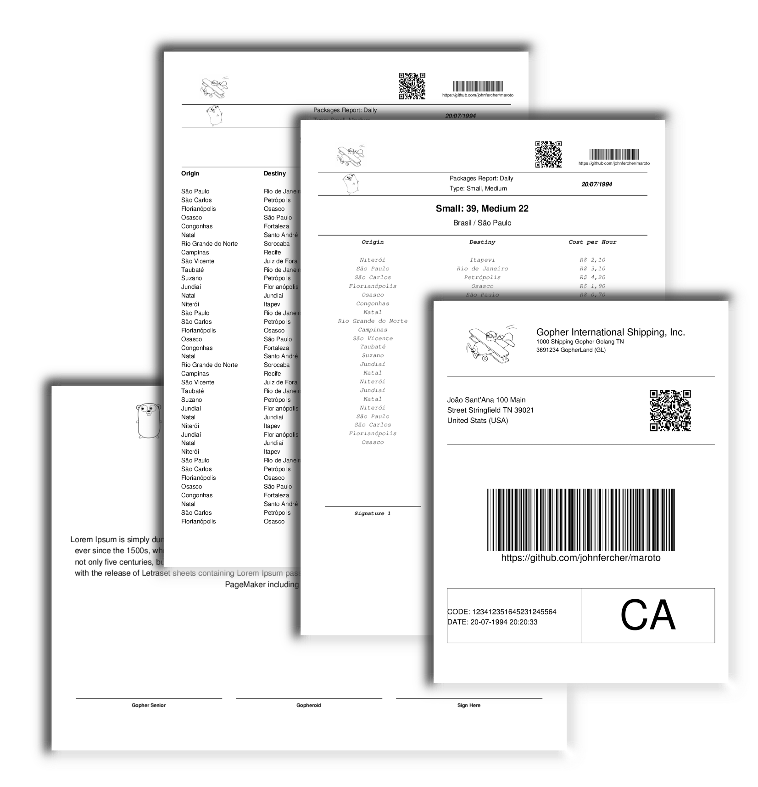

# Maroto [](https://godoc.org/github.com/johnfercher/maroto) [][travis] [][test] [](https://goreportcard.com/report/github.com/johnfercher/maroto)
A Maroto way to create PDFs. Maroto is inspired in Bootstrap and uses [Gofpdf](https://github.com/jung-kurt/gofpdf). Fast and simple.

> Maroto definition: Brazilian expression, means an astute/clever/intelligent person.

You can write your PDFs like you are creating a site using Bootstrap. A Row may have many Cols, and a Col may have many components. 
Besides that, pages will be added when content may extrapolate the useful area. You can define a header which will be added
always when a new page appear, in this case, a header may have many rows, lines or tablelist. 

## Installation

* With `go get`:

```bash
go get -u github.com/johnfercher/maroto
```

* With `dep`:

```bash
dep ensure -add github.com/johnfercher/maroto
```

## Features
* Grid System
    * [Row](https://godoc.org/github.com/johnfercher/maroto#PdfMaroto.Row)
    * [Col](https://godoc.org/github.com/johnfercher/maroto#PdfMaroto.Col)
    * [ColSpace](https://godoc.org/github.com/johnfercher/maroto#PdfMaroto.ColSpace)
    * [ColSpaces](https://godoc.org/github.com/johnfercher/maroto#PdfMaroto.ColSpaces)

* Components To Use Inside a Col
    * [Text w/ automatic new lines](https://godoc.org/github.com/johnfercher/maroto#PdfMaroto.Text)
    * [Signature](https://godoc.org/github.com/johnfercher/maroto#PdfMaroto.Signature)
    * Image ([From file](https://godoc.org/github.com/johnfercher/maroto#example-PdfMaroto-FileImage) or [Base64](https://godoc.org/github.com/johnfercher/maroto#PdfMaroto.Base64Image))
    * [QrCode](https://godoc.org/github.com/johnfercher/maroto#PdfMaroto.QrCode)
    * [Barcode](https://godoc.org/github.com/johnfercher/maroto#PdfMaroto.Barcode)   
    
* Components To Use Outside a Row
    * [TableList](https://godoc.org/github.com/johnfercher/maroto#PdfMaroto.TableList)
    * [Line](https://godoc.org/github.com/johnfercher/maroto#PdfMaroto.Line)
    
* Components To Wrap Row, TableList and Line
    * [RegisterHeader](https://godoc.org/github.com/johnfercher/maroto#PdfMaroto.RegisterHeader)
    
* Properties: most of the components has properties which you can use to customize appearance and behavior.
* [DebugMode](https://godoc.org/github.com/johnfercher/maroto#PdfMaroto.SetDebugMode): Used to draw rectangles in every row and column
* Automatic New Page: New pages are generated automatically when needed.
* 100% Unicode
* Save: You can [save on disk](https://godoc.org/github.com/johnfercher/maroto#PdfMaroto.OutputFileAndClose) or export to a [base64 string](https://godoc.org/github.com/johnfercher/maroto#PdfMaroto.Output)

**TODO**
* RegisterFooter
* Increase Code Coverage
* Create a custom mock with better assertions

## Examples
In the [PDFs](examples/internal/pdf) folder there are the PDFs generated
using Maroto, and in the [examples](examples/internal) folder there are subfolders
with the code to generate the PDFs.



#### Code
```go
func main() {
	m := maroto.NewMaroto(maroto.Portrait, maroto.A4)
	//m.SetDebugMode(true)

	byteSlices, _ := ioutil.ReadFile("examples/internal/assets/images/biplane.jpg")

	base64 := base64.StdEncoding.EncodeToString(byteSlices)

	headerSmall, smallContent := getSmallContent()
	headerMedium, mediumContent := getMediumContent()

	m.RegisterHeader(func() {

		m.Row(20, func() {
			m.Col(func() {
				m.Base64Image(base64, maroto.Jpg, maroto.RectProp{
					Percent: 70,
				})
			})

			m.ColSpaces(2)

			m.Col(func() {
				m.QrCode("https://github.com/johnfercher/maroto", maroto.RectProp{
					Percent: 75,
				})
			})

			m.Col(func() {
				id := "https://github.com/johnfercher/maroto"
				_ = m.Barcode(id, maroto.BarcodeProp{
					Proportion: maroto.Proportion{50, 10},
					Percent:    75,
				})
				m.Text(id, maroto.TextProp{
					Size:  7,
					Align: maroto.Center,
					Top:   16,
				})
			})
		})

		m.Line(1.0)

		m.Row(12, func() {
			m.Col(func() {
				m.FileImage("examples/internal/assets/images/gopherbw.png")
			})

			m.ColSpace()

			m.Col(func() {
				m.Text("Packages Report: Daily", maroto.TextProp{
					Top: 4,
				})
				m.Text("Type: Small, Medium", maroto.TextProp{
					Top: 10,
				})
			})

			m.ColSpace()

			m.Col(func() {
				m.Text("20/07/1994", maroto.TextProp{
					Size:   10,
					Style:  maroto.BoldItalic,
					Top:    7.5,
					Family: maroto.Helvetica,
				})
			})
		})

		m.Line(1.0)

		m.Row(22, func() {
			m.Col(func() {
				m.Text(fmt.Sprintf("Small: %d, Medium %d", len(smallContent), len(mediumContent)), maroto.TextProp{
					Size:  15,
					Style: maroto.Bold,
					Align: maroto.Center,
					Top:   9,
				})
				m.Text("Brasil / São Paulo", maroto.TextProp{
					Size:  12,
					Align: maroto.Center,
					Top:   17,
				})
			})
		})

		m.Line(1.0)

	})

	m.TableList(headerSmall, smallContent)

	m.TableList(headerMedium, mediumContent, maroto.TableListProp{
		Align: maroto.Center,
		HeaderProp: maroto.FontProp{
			Family: maroto.Courier,
			Style:  maroto.BoldItalic,
		},
		ContentProp: maroto.FontProp{
			Family: maroto.Courier,
			Style:  maroto.Italic,
		},
	})

	m.Row(40, func() {
		m.Col(func() {
			m.Signature("Signature 1", maroto.FontProp{
				Family: maroto.Courier,
				Style:  maroto.BoldItalic,
				Size:   9,
			})
		})

		m.Col(func() {
			m.Signature("Signature 2")
		})

		m.Col(func() {
			m.Signature("Signature 3")
		})
	})

	_ = m.OutputFileAndClose("examples/internal/pdfs/sample1.pdf")
}
```

[travis]: https://travis-ci.com/johnfercher/maroto
[test]: test.sh