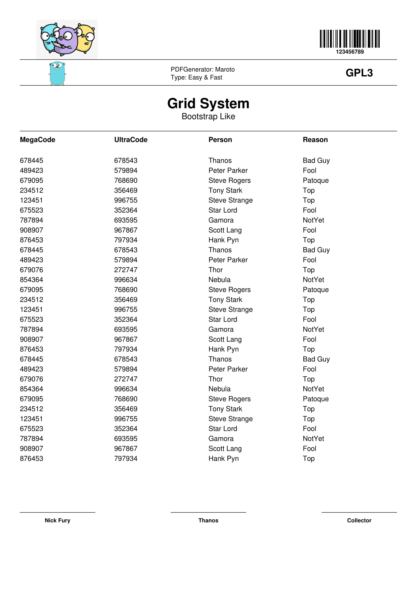

# Maroto [][travis]
A Maroto way to create PDFs. Maroto is inspired in Bootstrap and uses [Gofpdf](https://github.com/jung-kurt/gofpdf). Fast and simple.

> Maroto definition: Brazilian expression, means an astute/clever/intelligent person.

## Example

#### Result
Here is the [pdf](assets/pdf/maroto.pdf) generated.



#### Code
```go
func main() {
	m := maroto.NewMaroto(maroto.Vertical, maroto.A4)
	//m.SetDebugMode(true)

	byteSlices := getByteSlice()

	base64 := base64.StdEncoding.EncodeToString(byteSlices)

	header, contents := getContents()

	m.Row("Barcode", 20, func() {
		m.Col("Logo", func() {
			m.Base64Image(base64, 0, maroto.Png)
		})

		m.ColSpaces(2)

		m.Col("Barcode", func() {
			id := "123456789"
			_ = m.Barcode(id, 30, 9, 5)
			m.Text(id, maroto.Arial, maroto.Bold, 8, 17, maroto.Center)
		})
	})

	m.Line()

	m.Row("Logo", 12, func() {
		m.Col("Logo", func() {
			m.FileImage("assets/images/gopher1.jpg", 0)
		})

		m.ColSpace()

		m.Col("Definition", func() {
			m.Text("PDFGenerator: Maroto", maroto.Arial, maroto.Normal, 9, 5, maroto.Left)
			m.Text("Type: Easy & Fast", maroto.Arial, maroto.Normal, 9, 9, maroto.Left)
		})

		m.ColSpace()

		m.Col("Speed", func() {
			m.Text("GPL3", maroto.Arial, maroto.Bold, 15, 7.5, maroto.Center)
		})
	})

	m.Line()

	m.Row("SubTitle", 22, func() {
		m.ColSpaces(2)

		m.Col("Packages", func() {
			m.Text("Grid System", maroto.Arial, maroto.Bold, 20, 10.5, maroto.Center)
			m.Text("Bootstrap Like", maroto.Arial, maroto.Normal, 12, 16, maroto.Center)
		})

		m.ColSpaces(2)
	})

	m.Line()

	m.RowTableList("List", header, contents)

	m.Row("Signature", 30, func() {
		m.Col("Nick", func() {
			m.Signature("Nick Fury", maroto.Arial, maroto.Bold, 8)
		})

		m.ColSpace()

		m.Col("Thanos", func() {
			m.Signature("Thanos", maroto.Arial, maroto.Bold, 8)
		})

		m.ColSpace()

		m.Col("Collector", func() {
			m.Signature("Collector", maroto.Arial, maroto.Bold, 8)
		})
	})

	m.OutputFileAndClose("maroto.pdf")
}
```

[travis]: https://travis-ci.com/johnfercher/maroto