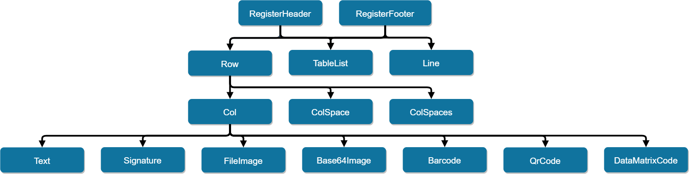

# Documentation

## Features

#### Constructors
* [New](https://pkg.go.dev/github.com/johnfercher/maroto/pkg/pdf#NewMaroto)
* [NewCustomSize](https://pkg.go.dev/github.com/johnfercher/maroto/pkg/pdf#NewMarotoCustomSize)

#### Grid System
* [Row](https://pkg.go.dev/github.com/johnfercher/maroto/pkg/pdf?tab=doc#PdfMaroto.Row)
* [Col](https://pkg.go.dev/github.com/johnfercher/maroto/pkg/pdf?tab=doc#PdfMaroto.Col)
* [ColSpace](https://pkg.go.dev/github.com/johnfercher/maroto/pkg/pdf?tab=doc#PdfMaroto.ColSpace)

#### Components To Use Inside a Col
* [Text w/ automatic new lines](https://pkg.go.dev/github.com/johnfercher/maroto/pkg/pdf?tab=doc#PdfMaroto.Text)
* [Signature](https://pkg.go.dev/github.com/johnfercher/maroto/pkg/pdf?tab=doc#PdfMaroto.Signature)
* Image ([From file](https://pkg.go.dev/github.com/johnfercher/maroto/pkg/pdf?tab=doc#PdfMaroto.FileImage) or [Base64](https://pkg.go.dev/github.com/johnfercher/maroto/pkg/pdf?tab=doc#PdfMaroto.Base64Image))
* [QrCode](https://pkg.go.dev/github.com/johnfercher/maroto/pkg/pdf?tab=doc#PdfMaroto.QrCode)
* [Barcode](https://pkg.go.dev/github.com/johnfercher/maroto/pkg/pdf?tab=doc#PdfMaroto.Barcode)
* [DataMatrixCode](https://pkg.go.dev/github.com/johnfercher/maroto/pkg/pdf?tab=doc#PdfMaroto.DataMatrixCode)

#### Components To Use Outside a Row
* [TableList](https://pkg.go.dev/github.com/johnfercher/maroto/pkg/pdf?tab=doc#PdfMaroto.TableList)
* [Line](https://pkg.go.dev/github.com/johnfercher/maroto/pkg/pdf?tab=doc#PdfMaroto.Line)

#### Components To Wrap Row, TableList and Line
* [RegisterHeader](https://pkg.go.dev/github.com/johnfercher/maroto/pkg/pdf?tab=doc#PdfMaroto.RegisterHeader)
* [RegisterFooter](https://pkg.go.dev/github.com/johnfercher/maroto/pkg/pdf?tab=doc#PdfMaroto.RegisterFooter)

#### Saving PDF
* [Output](https://pkg.go.dev/github.com/johnfercher/maroto/pkg/pdf#PdfMaroto.Output): Generate PDF and return a Base64 string
* [OutputFileAndClose](https://pkg.go.dev/github.com/johnfercher/maroto/pkg/pdf#PdfMaroto.OutputFileAndClose): Generate PDF and save in disk

#### Metadata
* [SetCompression](https://pkg.go.dev/github.com/johnfercher/maroto/pkg/pdf#PdfMaroto.SetCompression) Set/ unset compression for a page. Default value is on
* [SetProtection](https://pkg.go.dev/github.com/johnfercher/maroto/pkg/pdf#PdfMaroto.SetProtection): Define a password to open the PDF
* [SetAuthor](https://pkg.go.dev/github.com/johnfercher/maroto/pkg/pdf#PdfMaroto.SetAuthor): Define the author
* [SetCreator](https://pkg.go.dev/github.com/johnfercher/maroto/pkg/pdf#PdfMaroto.SetCreator): Define the creator
* [SetSubject](https://pkg.go.dev/github.com/johnfercher/maroto/pkg/pdf#PdfMaroto.SetSubject): Define the subject
* [SetTitle](https://pkg.go.dev/github.com/johnfercher/maroto/pkg/pdf#PdfMaroto.SetTitle): Define the title
* [SetCreationDate](https://pkg.go.dev/github.com/johnfercher/maroto/pkg/pdf#PdfMaroto.SetCreationDate): Define the creation date

#### Fonts
* [AddUTF8Font](https://pkg.go.dev/github.com/johnfercher/maroto/pkg/pdf#PdfMaroto.AddUTF8Font): Add a custom utf8 font and allow any character of any language.
* [SetDefaultFontFamily](https://pkg.go.dev/github.com/johnfercher/maroto/pkg/pdf#PdfMaroto.SetProtection): Define a default font family, useful to use with a custom font.
* [SetFontLocation](https://pkg.go.dev/github.com/johnfercher/maroto/pkg/pdf#PdfMaroto.SetFontLocation): Define the default path to search the custom font
* 100% Unicode

#### Page
* [AddPage](https://pkg.go.dev/github.com/johnfercher/maroto/pkg/pdf?tab=doc#PdfMaroto.AddPage): Skip the current page and start the build a new one
* [SetPageMargins](https://pkg.go.dev/github.com/johnfercher/maroto/pkg/pdf?tab=doc#PdfMaroto.SetPageMargins): Customize the page margins
* [SetAliasNbPages](https://pkg.go.dev/github.com/johnfercher/maroto/pkg/pdf#PdfMaroto.SetAliasNbPages): Set placeholder to use in texts for total count of pages
* [SetFirstPageNb](https://pkg.go.dev/github.com/johnfercher/maroto/pkg/pdf#PdfMaroto.SetFirstPageNb): Set first number for page numbering
* Automatic New Page: New pages are generated automatically when needed.

#### Customizations
* [Properties](https://pkg.go.dev/github.com/johnfercher/maroto/pkg/props?tab=doc): most of the components has properties which you can use to customize appearance and behavior
* [SetBorder](https://pkg.go.dev/github.com/johnfercher/maroto/pkg/pdf?tab=doc#PdfMaroto.SetBorder): Used to draw rectangles in every row and column
* [SetBackgroundColor](https://pkg.go.dev/github.com/johnfercher/maroto/pkg/pdf?tab=doc#PdfMaroto.SetBackgroundColor): Used to change the background color of one cell
* [SetMaxGridSum](https://pkg.go.dev/github.com/johnfercher/maroto/pkg/pdf?tab=doc#PdfMaroto.SetMaxGridSum): Sets max amount of cols per row, default is 12 cols per row

## Examples
In the [PDFs](internal/examples/pdfs) folder there are the PDFs generated
using Maroto, and in the [examples](internal/examples) folder there are subfolders
with the code to generate the PDFs. There are examples of: [barcode](internal/examples/barcode),
[billing](internal/examples/billing), [certificate](internal/examples/certificate),
[custom pdf size](internal/examples/customsize), [image inside grid](internal/examples/imagegrid),
[qrcode inside grid](internal/examples/qrgrid), [sample with almost all features together](internal/examples/sample1),
[text inside grid](internal/examples/textgrid), [custom utf8 fonts (any language)](internal/examples/utfsample) and a
[label zpl](internal/examples/zpl).

## Other Examples

| Title | Media |
|---|---|
| [How to create PDFs with Go, Maroto & GoFakeIt](https://www.youtube.com/watch?v=jwOy4JgleTU) | Video |
| [Creating a PDF with Go, Maroto & Gofakeit](https://divrhino.com/articles/create-pdf-document-with-go-maroto-gofakeit) | Article |
| [divrhino/fruitful-pdf](https://github.com/divrhino/fruitful-pdf) | Repository |
| [Creating PDFs using Golang](https://medium.com/@johnathanfercher/creating-pdfs-using-golang-98b722e99d6d) | Article |
